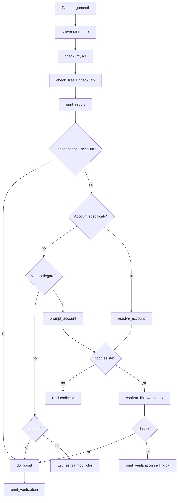

# associate-pg-account.sh — guida operativa

Script Bash per **verificare** un personaggio (PG) su Nebbie Arcane, **collegarlo** a un account MySQL (`user` → `toon.owner_id`) e, opzionalmente, **forzare il livello** del PG nel database.

Percorso: `scripts/associate-pg-account.sh`

> Lo script **non modifica il codice del MUD** e **non tocca i file** `players/*.dat` o `rent/*`. Agisce solo su **MySQL** (e legge i file solo per diagnostica).

---

## A cosa serve

| Operazione | Cosa fa nel DB |
|------------|----------------|
| **Report** | Mostra se il PG esiste in `toon`, chi è l’owner, livello, migrazione, file su disco |
| **Collegamento** | `UPDATE toon SET owner_id = <user.id>` |
| **Boost livello** | `UPDATE toon.level` +, se migrate, `character_classes` e `character_stats` |

Casi d’uso tipici in dev/test:

- Associare un PG importato (es. Sirio) all’account `wizmorgan@gmail.com`
- Verificare che esistano sia la riga `toon` sia i file sotto `mudroot/lib`
- Portare un PG a livello 60 senza editare a mano le tabelle

Script correlato, più limitato: `scripts/link-dev-toons-to-account.sh` (solo Sirio + account dev predefinito).

---

## Prerequisiti

- **MySQL** raggiungibile con database `nebbie` (default dev: `root` / `secret` su `127.0.0.1:3306`)
- Client `mysql` in PATH
- Opzionale: `python3` (per leggere il nome interno dal file `.dat`)
- Per il **collegamento**: riga in tabella `toon` per il PG (creata al primo login con quel nome, se assente)
- Per il **boost completo**: PG già migrato su schema `character_*` (almeno una riga in `character_core` — di solito dopo un login post-migrazione)

### Variabili d’ambiente

| Variabile | Default | Descrizione |
|-----------|---------|-------------|
| `MYSQL_HOST` | `127.0.0.1` | Host MySQL |
| `MYSQL_PORT` | `3306` | Porta |
| `MYSQL_USER` | `root` | Utente |
| `MYSQL_PASSWORD` | `secret` | Password |
| `MYSQL_DB` | `nebbie` | Database |
| `MUD_LIB` | auto | Directory `lib` del mud (cerca `players/` in percorsi noti) |
| `DEV_TOON_LEVEL` | `60` | Livello predefinito per `--boost` |

Esempio:

```bash
export MYSQL_HOST=127.0.0.1
export MUD_LIB=/home/nebbie/Server/mudroot/lib
./scripts/associate-pg-account.sh Sirio --boost -y
```

---

## Sintassi

```text
./scripts/associate-pg-account.sh [nome_pg] [opzioni]
```

### Opzioni

| Opzione | Descrizione |
|---------|-------------|
| `-a`, `--account <email\|id>` | Account destinazione (email o `user.id` numerico) |
| `-f`, `--force` | Riassegna anche se `toon.owner_id` punta già a un altro account |
| `-b`, `--boost` | Forza il livello del PG su MySQL (default: 60) |
| `--level <n>` | Livello da impostare con il boost (1–60); implica `--boost` |
| `-y`, `--yes` | Salta le conferme interattive |
| `-n`, `--dry-run` | Solo controlli e messaggi `[dry-run]`, nessun `UPDATE` |
| `-h`, `--help` | Help a riga di comando |

Il **nome PG** deve essere solo lettere, massimo 15 caratteri (come in gioco).

---

## Esempi

### Solo ispezione (interattivo)

```bash
./scripts/associate-pg-account.sh Sirio
```

Stampa il report e chiede se vuoi collegare l’account (risposta `N` = nessuna modifica).

### Collegare a un account

```bash
./scripts/associate-pg-account.sh Sirio -a wizmorgan@gmail.com --yes
./scripts/associate-pg-account.sh Sirio -a 42 --force -y   # per id numerico, anche se già assegnato
```

### Solo boost livello 60

```bash
./scripts/associate-pg-account.sh Sirio --boost --yes
./scripts/associate-pg-account.sh Sirio --boost --level 60 -y
```

Con `--boost` e **senza** `--account`, lo script **non** chiede il collegamento: esegue solo il boost e termina.

### Collegamento + boost

```bash
./scripts/associate-pg-account.sh Sirio -a wizmorgan@gmail.com --boost -y
```

Ordine: prima collegamento (`owner_id`), poi boost livello.

### Anteprima senza scrivere

```bash
./scripts/associate-pg-account.sh Sirio -a wizmorgan@gmail.com --boost -n
```

---

## Flusso dello script



---

## Report: cosa significa ogni voce

### Database

| Voce | Significato |
|------|-------------|
| **toon.id** | Chiave primaria del PG in MySQL |
| **toon.name** | Nome personaggio |
| **toon.level** | Livello memorizzato in tabella `toon` |
| **toon.owner_id** | `0` = non collegato; altrimenti `user.id` dell’account |
| **toon.migrated_at** | Data migrazione su schema `character_*` (se applicabile) |
| **toon.schema_version** | Versione schema PG migrato |
| **character_core** | Numero righe in `character_core` per questo `toon_id` |
| **legacy.email1** | Email storica da tabella `legacy` (se presente) |

### File mud (sotto `MUD_LIB`, nome file in **minuscolo**)

| File | Significato |
|------|-------------|
| `players/<nome>.dat` | Salvataggio classico del PG |
| `players/<nome>.dead` | PG morto |
| `rent/<nome>` | Inventario in rent |
| `rent/<nome>.aux` | Dati ausiliari rent |

Se compare un **nome interno nel .dat** diverso dal nome passato allo script, i file potrebbero non corrispondere al PG che cerchi.

### Messaggi di avviso comuni

| Messaggio | Causa |
|-----------|--------|
| PG assente da DB e da `.dat` | Nome errato o PG mai creato |
| `.dat` presente ma `toon` assente | Al primo login il MUD creerà la riga |
| Senza riga `toon` non posso collegare | Fai login una volta con quel nome, poi rilancia |

---

## Collegamento account (dettaglio)

Lo script esegue:

```sql
UPDATE toon SET owner_id = <user.id> WHERE id = <toon.id>;
```

Regole:

- Se il PG è **già** collegato allo stesso account → messaggio informativo, nessun errore
- Se `owner_id` punta a **un altro** account → errore, a meno di `--force`
- **Non** crea righe in `toon`: il PG deve esistere già (login o import)

L’account si risolve per **email** (case-insensitive) o per **id numerico** `user.id`.

---

## Boost livello (dettaglio)

Funzione interna: `boost_toon_level(toon_id, nome)`.

### Cosa aggiorna

1. **Sempre:** `toon.level = <TARGET_LEVEL>` (default 60, max 60)
2. **Se esiste tabella `character_core` e c’è almeno una riga per il PG:**
   - `character_classes`: livelli classi indici `0`–`10` → `TARGET_LEVEL`
   - `character_stats`: `exp = 30000000`, `true_exp = 0`
3. **Se `character_core` manca:** solo `toon.level`, con avviso di fare un login e rilanciare

### Cosa **non** aggiorna

- `user.level` dell’account (livello autorizzazione account / immortale)
- File `players/*.dat` o `rent/*`
- PG già **connesso in gioco**: può mostrare il livello vecchio in sessione finché non si **rilogga** (il client ricarica da MySQL)

### Livello personalizzato

```bash
DEV_TOON_LEVEL=55 ./scripts/associate-pg-account.sh Alar --boost -y
# oppure
./scripts/associate-pg-account.sh Alar --boost --level 55 -y
```

---

## Verifica finale

Dopo collegamento o boost, lo script stampa:

- Riga `toon` con `toon_id`, `name`, `level`, `owner_id`, `account_email`, `migrated_at`
- Se presente lo schema: tabella `character_classes` per quel `toon_id`

Controllo manuale:

```bash
mysql -h 127.0.0.1 -uroot -psecret nebbie -e \
  "SELECT t.name, t.level, t.owner_id, u.email
   FROM toon t LEFT JOIN user u ON u.id=t.owner_id
   WHERE LOWER(t.name)=LOWER('Sirio');"
```

---

## Codici di uscita

| Codice | Significato |
|--------|-------------|
| `0` | Successo o uscita senza modifiche richieste |
| `1` | Errore (MySQL irraggiungibile, PG/account non valido, UPDATE fallito, ecc.) |
| `2` | Report ok ma impossibile collegare: manca riga `toon` |

---

## Confronto con `link-dev-toons-to-account.sh`

| | `associate-pg-account.sh` | `link-dev-toons-to-account.sh` |
|--|---------------------------|--------------------------------|
| PG | Qualsiasi nome in argomento | Solo `DEV_TOON_NAMES` (default Sirio) |
| Account | Email/id scelto | Fisso `wizmorgan@gmail.com` |
| Report file/DB | Sì, esteso | No |
| Boost | `--boost` / `--level` | `--boost` |
| Interattivo | Sì | No |

Per setup Vagrant automatico si usa ancora `link-dev-toons-to-account.sh` nel provision script; per operazioni manuali su un PG qualsiasi usa `associate-pg-account.sh`.

---

## Risoluzione problemi

| Problema | Azione |
|----------|--------|
| `MySQL non raggiungibile` | Avvia mysqld; verifica host/porta/credenziali |
| `Account non trovato` | Registra l’account via login web/telnet o inseriscilo in `user` |
| `Impossibile collegare: toon assente` | Login in gioco con quel nome PG, poi rilancia |
| Boost solo su `toon.level` | Fai un login (crea `character_core`), poi `--boost` di nuovo |
| In gioco livello ancora 58 | Rilogga il PG dopo il boost |
| PG già assegnato ad altro | Usa `--force` se la riassegnazione è intenzionale |

---

## Riferimenti

- Script: `scripts/associate-pg-account.sh`
- Script dev rapido: `scripts/link-dev-toons-to-account.sh`
- Schema PG migrato: `docs/schema-s1-ddl-draft.sql`
- Dedupe utenti duplicati (login): `docs/dedupe-user-by-email.sql`
