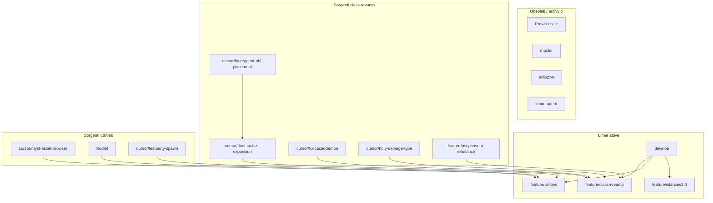

# Riorganizzazione branch — mud-reorganisation

Documento di analisi e piano operativo (2026-07-09).

## Obiettivo

Raggruppare i branch sparsi del fork `wizardmorgan/nebbietest` in linee di sviluppo coerenti:

| Linea | Branch proposto | Base |
|-------|-----------------|------|
| Revamp classi MUD | `feature/class-revamp` | `develop` |
| Utility (client, DB oggetti, test) | `feature/utilities` | `develop` |
| Istanze / procarea | `feature/istances2.0` | *(esistente, invariato)* |
| Release | `develop` → `master` | git-flow |

---

## 1. Revamp classi → `feature/class-revamp`

### Branch sorgente

| Branch remoto | Stato | Commit unici vs develop | Contenuto principale |
|---------------|-------|-------------------------|----------------------|
| `cursor/thief-tactics-expansion-3a37` | **Parzialmente in develop** (PR #12, `1a56c14`) | ~25 commit ancora fuori | Helptbl ladro, shop reagenti, vnum 18000–18005, diagnostica crash |
| `cursor/fix-reagent-obj-placement-3a37` | **Già integrato** in thief-tactics | 0 | — |
| `cursor/fix-cacaodemon-4451` | Da integrare | 1 commit proprio + storia condivisa | Power index, proc cacaodemon, comando `powerindex` |
| `cursor/holy-damage-type-a00f` | Da integrare | 4 commit propri | `IMM_HOLY`, menu medit/oedit, fix porta MySQL ODB |
| `feature/psi-phase-a-rebalance` | Da integrare | 11 commit propri | Rebalance PSI L1–50, Kaelith GM, metapsionics |

### Relazioni tra i branch

```
develop (b7f367e)
  │
  ├── thief-tactics ── merge-base: 1a56c14 (PR #12 già mergiato)
  │     └── +25 commit: helptbl, shop, vnum overlay-safe
  │
  └── altri 3 branch ── merge-base: 91c7d0fd (105 commit indietro vs develop!)
        ├── cacaodemon ──┐
        ├── holy-damage ─┼── condividono PR #7 test-integrazione-docker
        └── psi-rebalance ┘
```

**Attenzione:** cacaodemon, holy-damage e psi condividono ~40 commit di storia (docker consumer, script dev, helptbl cacaodemon). Non vanno mergiati tutti e tre in sequenza — si rischia triplicazione. Strategia consigliata:

1. Partire da `develop`
2. Merge `cursor/thief-tactics-expansion-3a37` (vicino a develop, conflitti limitati)
3. Merge **uno** dei branch “integrati” (es. `feature/psi-phase-a-rebalance`, il più completo) come base comune
4. Cherry-pick dei commit **unici** dagli altri:
   - `3c528e5` — power index redesign (cacaodemon)
   - `9bb6352`, `91b0746` — IMM_HOLY (holy-damage)
   - `a436848`, `d3792db` — fix MySQL port + docker consumer (holy-damage; valutare se già coperti da develop)

### File a rischio conflitto

| File | Branch coinvolti |
|------|------------------|
| `pages/helptbl`, `mudroot/lib/helptbl` | cacaodemon, holy, psi, thief |
| `myst.obj` | cacaodemon, holy, psi, thief |
| `src/spells2.cpp`, `src/spell_parser.cpp` | cacaodemon, holy, psi |
| `src/act.wizard.cpp` | cacaodemon, holy, psi |

---

## 2. Utility → `feature/utilities`

| Branch remoto | Commit vs develop | Contenuto |
|---------------|-------------------|-----------|
| `cursor/myst-asset-browser-ce44` | +2 | `tools/myst-assets/` — browser SQLite oggetti/mob/room |
| `mudlet` | +129 | Package Mudlet v2.2.x in `docs/mudlet/` |
| `cursor/testparty-spawn-901d` | +1 | Comando `testparty` + script Python per gruppi test L50 |

**Nota:** `testparty` modifica `src/act.wizard.cpp` — va tenuto separato dal revamp classi ma serve per testare le nuove classi.

**Nota:** `mudlet` è un superset di `sviluppo` per quanto riguarda il package Mudlet (67 commit in più, 0 mancanti). Il branch `mudlet` è la fonte canonica per il client.

Merge previsto: develop → myst-asset-browser → mudlet → testparty (in quest’ordine).

---

## 3. Branch principali — analisi dedicata

### `develop` (HEAD attuale: `b7f367e`)

- Linea di release git-flow
- Contiene PR #12 thief tactics (core skills L5–51)
- Contiene tooling docker consumer parziale (`b63fec2`)
- **Usare come base** per tutti i nuovi branch

### `master` (HEAD: `dd6f108`, nov 2025)

- **Obsoleto:** 218 commit indietro rispetto a develop
- Unico commit proprio: revert merge errato da corra72/Server
- **Azione:** non usare; aggiornare solo via `git flow release` da develop

### `sviluppo` (HEAD: `a77c11d`, giu 2026)

- Linea di sviluppo **pre-git-flow** sul fork
- 62 commit propri vs develop: fix login/PG, dedupe SQL, titoli custom, **prime versioni Mudlet 1.0.x**
- Merge-base con develop: `91c7d0fd` (105 commit indietro)
- **Overlap con `mudlet`:** tutto sviluppo ⊆ mudlet; mudlet ha 67 commit in più (v2.x)
- **Overlap con `feature/istances2.0`:** merge-base `91c7d0fd`
- **Azione:** archiviare; portare in develop solo fix login/SQL ancora validi (cherry-pick selettivo)

### `feature/istances2.0` (HEAD: `609f2ac`, lug 2026)

- Sviluppo **Dimensioni Effimere / procarea** — linea separata dal revamp classi
- 50 commit propri vs develop: istanze, achievement, equip lock, Minor Harm cleric, tier gruppo
- Documentazione: `docs/dev/git-workflow-istances2.0.md`
- **Azione:** mantenere branch dedicato; non fondere con class-revamp

---

## 4. Branch probabilmente obsoleti

### `ProvaLocale` (HEAD: `764053f`, **maggio 2021**)

- 326 commit indietro vs develop
- Contenuto: handler.cpp, fight.cpp, RaceRevolutionPartOne — codice pre-rifattorizzazione
- **Azione:** eliminare o taggare `archive/provalocale-2021`; nessun merge

### `cursor/cloud-agent-1781395667873-cprro` (HEAD: `feff821`, giu 2026)

- Script `associate-pg-account.sh --grant-skills` per boost PG in dev
- Include anche commit Mudlet 1.0.x già in sviluppo/mudlet
- **Azione:** cherry-pick solo `scripts/associate-pg-account.sh` + docs in `feature/utilities` o develop; poi eliminare branch

---

## 5. Branch da eliminare dopo la fusione

| Branch | Motivo |
|--------|--------|
| `cursor/fix-reagent-obj-placement-3a37` | Già in thief-tactics |
| `cursor/thief-tactics-expansion-3a37` | Dopo merge in class-revamp |
| `cursor/fix-cacaodemon-4451` | Dopo merge in class-revamp |
| `cursor/holy-damage-type-a00f` | Dopo merge in class-revamp |
| `feature/psi-phase-a-rebalance` | Dopo merge in class-revamp |
| `cursor/myst-asset-browser-ce44` | Dopo merge in utilities |
| `cursor/testparty-spawn-901d` | Dopo merge in utilities |
| `ProvaLocale` | Obsoleto |
| `cursor/cloud-agent-1781395667873-cprro` | Dopo cherry-pick script |
| `sviluppo` | Dopo verifica fix residui |

---

## 6. Piano operativo (sequenza consigliata)

```bash
# 1. Class revamp
git checkout -b feature/class-revamp develop
git merge origin/cursor/thief-tactics-expansion-3a37   # risolvere helptbl/vnum
git merge origin/feature/psi-phase-a-rebalance          # base comune cacaodemon+psi
git cherry-pick 3c528e5                                 # power index redesign
git cherry-pick 9bb6352 91b0746                         # IMM_HOLY

# 2. Utilities
git checkout -b feature/utilities develop
git merge origin/cursor/myst-asset-browser-ce44
git merge origin/mudlet
git merge origin/cursor/testparty-spawn-901d
git cherry-pick feff821 1b89c0c 5b84695                 # associate-pg-account (opzionale)

# 3. Push
git push -u origin feature/class-revamp
git push -u origin feature/utilities
```

---

## 7. Mappa visiva



---

## 8. Stato attuale develop vs revamp

Cosa **manca** ancora in develop (al 2026-07-09):

- [ ] Cacaodemon proc + power index
- [ ] IMM_HOLY damage type
- [ ] PSI phase A rebalance
- [ ] Thief: helptbl completo, shop reagenti, vnum overlay-safe (18000–18005)
- [ ] Myst asset browser
- [ ] Mudlet package v2.x
- [ ] Comando testparty

Cosa **c’è già** in develop:

- [x] Thief tactics core (14 skill L5–51, crafting base, poison) — PR #12
- [x] Docker consumer tooling parziale
- [x] PostgreSQL scripts/docs
